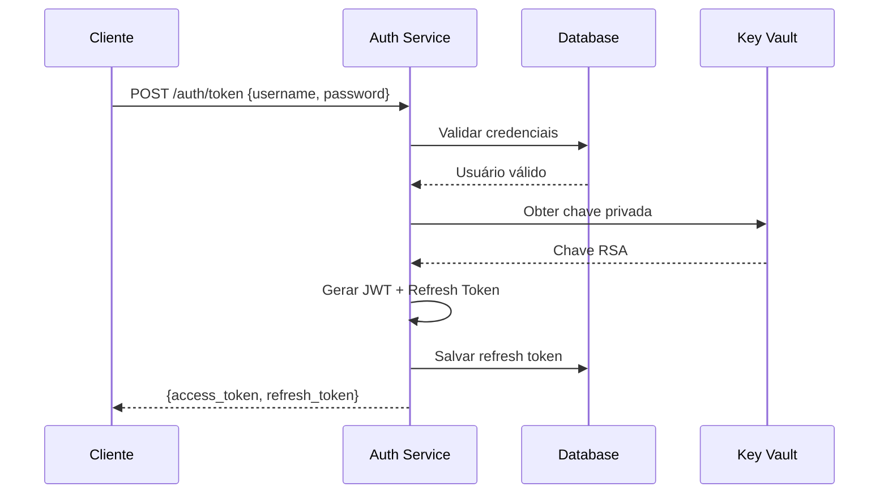

# 🔐 Microserviço de Autenticação - Conexão de Sorte

[](https://openjdk.java.net/projects/jdk/24/)
[](https://spring.io/projects/spring-boot)
[](https://docs.spring.io/spring-framework/docs/current/reference/html/web-reactive.html)
[](https://r2dbc.io/)
[](https://www.docker.com/)

Microserviço de autenticação **100% reativo** construído com **Spring WebFlux**, **R2DBC** e **Spring Security**. Implementa padrões OAuth2/OpenID Connect para emissão e validação de tokens JWT com suporte a rotação de chaves via **Azure Key Vault**.

## 📋 Índice

- [🚀 Características](#-características)
- [🏗️ Arquitetura](#️-arquitetura)
- [⚡ Início Rápido](#-início-rápido)
- [🔧 Configuração](#-configuração)
- [📚 API Documentation](#-api-documentation)
- [🧪 Testes](#-testes)
- [📊 Observabilidade](#-observabilidade)
- [🚀 Deploy](#-deploy)
- [🔒 Segurança](#-segurança)
- [🤝 Contribuindo](#-contribuindo)

## 🚀 Características

### ⚡ Stack Reativa
- **Spring WebFlux**: Framework reativo não-bloqueante
- **R2DBC**: Acesso reativo ao banco MySQL
- **Reactor**: Programação reativa com Mono/Flux
- **Spring Security Reactive**: Segurança reativa

### 🔐 Autenticação Robusta
- **JWT (RFC 7519)**: Tokens seguros com assinatura RSA256
- **JWKS (RFC 7517)**: Descoberta automática de chaves públicas
- **Token Introspection (RFC 7662)**: Validação de tokens
- **Refresh Tokens**: Rotação automática com família de tokens
- **Rate Limiting**: Proteção contra ataques de força bruta

### 🔑 Gerenciamento de Chaves
- **Azure Key Vault**: Rotação automática de chaves RSA
- **Fallback Seguro**: Chaves locais para desenvolvimento
- **Cache Inteligente**: Otimização de performance

### 🏗️ Padrões Enterprise
- **Domain-Driven Design (DDD)**: Arquitetura em camadas
- **Clean Architecture**: Separação de responsabilidades
- **SOLID Principles**: Código maintível e testável
- **Reactive Patterns**: Não-bloqueante end-to-end

### 📊 Observabilidade
- **Spring Actuator**: Health checks e métricas
- **Micrometer + Prometheus**: Métricas de performance
- **Distributed Tracing**: Rastreamento de requisições
- **Structured Logging**: Logs em formato JSON

## 🏗️ Arquitetura

```
┌─────────────────────────────────────────────────────────────┐
│                     API Gateway / Load Balancer             │
└─────────────────────────┬───────────────────────────────────┘
                          │
┌─────────────────────────▼───────────────────────────────────┐
│                  Microserviço Autenticação                 │
│                                                             │
│  ┌─────────────┐ ┌─────────────┐ ┌─────────────────────┐   │
│  │ Controllers │ │  Services   │ │     Repositories    │   │
│  │  (WebFlux)  │ │ (Business)  │ │      (R2DBC)       │   │
│  └─────────────┘ └─────────────┘ └─────────────────────┘   │
│                                                             │
│  ┌─────────────────────────────────────────────────────┐   │
│  │              Security Layer                         │   │
│  │    JWT | CORS | Rate Limiting | HTTPS              │   │
│  └─────────────────────────────────────────────────────┘   │
└─────────────────────────┬───────────────────────────────────┘
                          │
        ┌─────────────────┼─────────────────┐
        │                 │                 │
┌───────▼──────┐ ┌────────▼────────┐ ┌─────▼──────┐
│    MySQL     │ │      Redis      │ │Azure Key   │
│   (R2DBC)    │ │    (Cache)      │ │   Vault    │
└──────────────┘ └─────────────────┘ └────────────┘
```

### 📦 Estrutura do Projeto

```
src/main/java/br/tec/facilitaservicos/autenticacao/
├── 📁 config/          # Configurações (Security, R2DBC, CORS)
├── 📁 controller/      # REST Controllers (WebFlux)
├── 📁 dto/            # Data Transfer Objects (Records)
├── 📁 entity/         # Entidades JPA/R2DBC
├── 📁 exception/      # Exceções customizadas
├── 📁 repository/     # Repositórios R2DBC
├── 📁 service/        # Lógica de negócio
└── 📄 AutenticacaoApplication.java
```

## ⚡ Início Rápido

### Pré-requisitos
- ☕ **Java 24+**
- 🐳 **Docker & Docker Compose**
- 📦 **Maven 3.9+**

### 🚀 Execução Local

1. **Clone o repositório**
```bash
git clone https://github.com/seu-usuario/conexao-de-sorte-backend-autenticacao.git
cd conexao-de-sorte-backend-autenticacao
```

2. **Iniciar ambiente completo**
```bash
docker-compose up -d
```

3. **Verificar saúde dos serviços**
```bash
curl http://localhost:8081/actuator/health
```

4. **Acessar documentação da API**
```bash
open http://localhost:8081/swagger-ui.html
```

### 🔧 Desenvolvimento Local

```bash
# Apenas banco de dados
docker-compose up -d mysql redis

# Executar aplicação
./mvnw spring-boot:run -Dspring-boot.run.profiles=dev
```

## 🔧 Configuração

### 🌍 Variáveis de Ambiente

| Variável | Descrição | Padrão |
|----------|-----------|---------|
| `SPRING_PROFILES_ACTIVE` | Perfil ativo | `dev` |
| `DB_HOST` | Host do MySQL | `localhost` |
| `DB_USERNAME` | Usuário do banco | `conexao_sorte` |
| `DB_PASSWORD` | Senha do banco | `senha123` |
| `REDIS_HOST` | Host do Redis | `localhost` |
| `JWT_ISSUER` | Emissor do JWT | `https://auth.conexaodesorte.com` |
| `AZURE_KEYVAULT_URI` | URI do Key Vault | - |
| `FEATURE_AUTH_MS` | Ativar microserviço | `false` |

### ⚙️ Profiles Disponíveis

- **`dev`**: Desenvolvimento local
- **`test`**: Execução de testes
- **`prod`**: Produção

### 🔐 Azure Key Vault (Opcional)

Para usar rotação de chaves em produção:

```bash
export AZURE_KEYVAULT_URI=https://seu-keyvault.vault.azure.net/
export AZURE_CLIENT_ID=sua-app-registration-id
# OIDC-only: não utilizar AZURE_CLIENT_SECRET; use OIDC + Key Vault
export AZURE_TENANT_ID=seu-tenant-id
```

## 📚 API Documentation

### 🔗 Endpoints Principais

| Método | Endpoint | Descrição |
|--------|----------|-----------|
| `POST` | `/auth/token` | Autenticação (login) |
| `POST` | `/auth/refresh` | Renovar token |
| `POST` | `/auth/introspect` | Validar token |
| `POST` | `/auth/revoke` | Revogar token |
| `GET` | `/.well-known/jwks.json` | JWK Set público |
| `GET` | `/actuator/health` | Status da aplicação |

### 🔐 Fluxo de Autenticação



### 📝 Exemplos de Uso

#### Autenticação
```bash
curl -X POST http://localhost:8081/auth/token \
  -H "Content-Type: application/json" \
  -d '{
    "username": "admin@conexaodesorte.com",
    "password": "admin123"
  }'
```

#### Renovar Token
```bash
curl -X POST http://localhost:8081/auth/refresh \
  -H "Content-Type: application/json" \
  -d '{
    "refresh_token": "seu-refresh-token-aqui"
  }'
```

#### Validar Token
```bash
curl -X POST http://localhost:8081/auth/introspect \
  -H "Content-Type: application/json" \
  -d '{
    "token": "seu-jwt-token-aqui"
  }'
```

## 🧪 Testes

### Executar Testes
```bash
# Todos os testes
./mvnw test

# Apenas testes unitários
./mvnw test -Dgroups=unit

# Apenas testes de integração
./mvnw test -Dgroups=integration
```

### 🐳 Testes com Testcontainers
Os testes de integração usam **Testcontainers** para:
- MySQL real em container
- Redis para cache
- Ambiente isolado por teste

## 📊 Observabilidade

### 📈 Métricas (Prometheus)
- `http://localhost:9090` - Prometheus UI
- Métricas de performance, latência, throughput
- Health checks e status dos componentes

### 📊 Dashboards (Grafana)
- `http://localhost:3001` - Grafana UI (admin/admin123)
- Dashboards pré-configurados para:
  - Performance da aplicação
  - Métricas de autenticação
  - Status do banco de dados

### 🔍 Distributed Tracing (Jaeger)
- `http://localhost:16686` - Jaeger UI
- Rastreamento de requisições end-to-end
- Análise de latência por operação

## 🚀 Deploy

### 🐳 Docker Build
```bash
docker build -t conexao-sorte/autenticacao:latest .
```

### ☸️ Kubernetes (Exemplo)
```yaml
apiVersion: apps/v1
kind: Deployment
metadata:
  name: autenticacao
spec:
  replicas: 3
  selector:
    matchLabels:
      app: autenticacao
  template:
    spec:
      containers:
      - name: autenticacao
        image: conexao-sorte/autenticacao:latest
        ports:
        - containerPort: 8081
        env:
        - name: SPRING_PROFILES_ACTIVE
          value: "prod"
        - name: DB_HOST
          value: "mysql-service"
```

## 🔒 Segurança

### 🛡️ Características de Segurança

- **JWT Seguro**: Tokens assinados com RSA256
- **Rate Limiting**: Proteção contra força bruta
- **CORS Configurado**: Origens permitidas explícitas
- **Headers de Segurança**: CSP, HSTS, etc.
- **Validação Rigorosa**: Entrada validada em todos os endpoints
- **Secrets Management**: Integração com Azure Key Vault
- **Container Não-Root**: Execução com usuário limitado

### 🔐 Matriz de Erros

| Código | Erro | Descrição |
|--------|------|-----------|
| `400` | `invalid_request` | Requisição malformada |
| `401` | `invalid_grant` | Credenciais inválidas |
| `423` | `account_locked` | Conta temporariamente bloqueada |
| `429` | `too_many_requests` | Rate limit excedido |
| `500` | `internal_server_error` | Erro interno |

### 🎯 SLA/SLO

- **Disponibilidade**: 99.9%
- **Latência P95**: < 200ms
- **Latência P99**: < 500ms
- **Throughput**: 1000 req/s por instância
- **Recovery Time**: < 30s

## 🤝 Contribuindo

### 📋 Padrões de Código
- **Java Code Style**: Google Java Format
- **Commit Convention**: Conventional Commits
- **Testing**: Cobertura mínima 80%
- **Documentation**: JavaDoc obrigatório para APIs públicas

### 🔄 Processo de Development
1. Fork do repositório
2. Criar feature branch (`git checkout -b feature/nova-funcionalidade`)
3. Implementar mudanças com testes
4. Commit seguindo padrão (`git commit -m 'feat: adicionar endpoint X'`)
5. Push para branch (`git push origin feature/nova-funcionalidade`)
6. Criar Pull Request

---

## 📄 Licença

Este projeto está sob a licença MIT. Veja o arquivo [LICENSE](LICENSE) para detalhes.

## 👥 Time

- **Arquitetura**: Equipe de Arquitetura
- **Desenvolvimento**: Time Backend
- **DevOps**: Equipe de Infraestrutura
- **Segurança**: Time de Security

---

**🔐 Microserviço de Autenticação - Conexão de Sorte**  
*Segurança, Performance e Confiabilidade*
